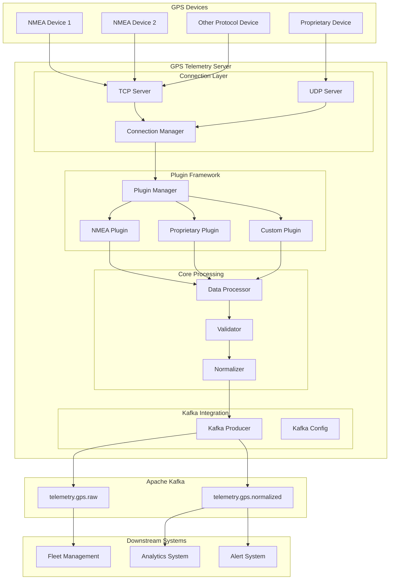
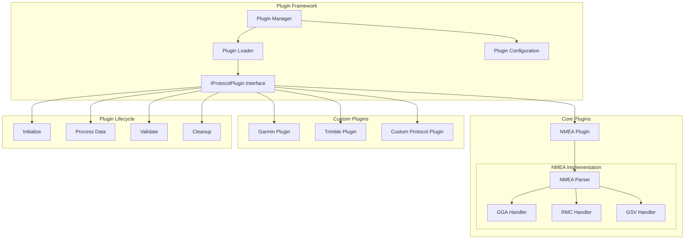
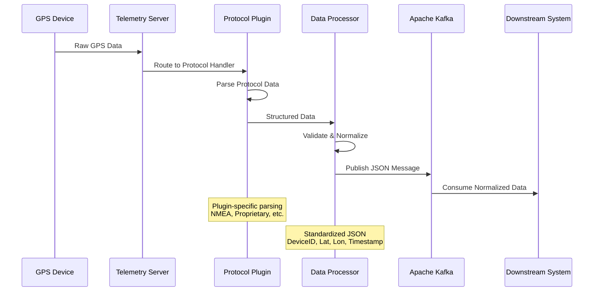

# GPS Telemetry Server - Product Requirements Document

## Executive Summary

This document outlines the requirements for a GPS telemetry server that receives GPS data from various vehicle-mounted devices and publishes unified JSON messages to Apache Kafka. The system uses a plugin architecture to support multiple GPS protocols, with out-of-the-box support for NMEA-compatible devices.

**Market Context**: The GPS tracking software market is valued at $3.6B in 2024 and expected to reach $8.2B by 2033 (CAGR: 9.8%). Fleet management accounts for 40% of market share, driven by real-time monitoring demands.

**Key Success Metrics**:
- Support for 10+ GPS protocols via plugin architecture
- Process 10,000+ concurrent device connections
- <100ms message processing latency
- 99.9% uptime for critical fleet operations

## Problem Statement

Current GPS tracking solutions face several challenges:
- **Protocol Fragmentation**: Different GPS devices use various protocols (NMEA, proprietary formats)
- **Vendor Lock-in**: Monolithic systems limit protocol extensibility
- **Scaling Issues**: Real-time processing of high-volume telemetry data
- **Integration Complexity**: Difficult to integrate with existing fleet management systems

## Solution Overview

A modular GPS telemetry server built on .NET Core that:
1. **Receives** GPS data from multiple device types simultaneously
2. **Processes** data through protocol-specific plugins
3. **Normalizes** all data into unified JSON format
4. **Publishes** to Kafka for downstream consumption

## User Stories

### Epic 1: Core Telemetry Processing

#### Story 1.1: Device Connection Management
**As a** fleet manager  
**I want** GPS devices to automatically connect and maintain stable connections  
**So that** I receive continuous location updates without manual intervention  

**Acceptance Criteria:**
- [ ] Support TCP/UDP connections for GPS devices
- [ ] Automatic reconnection on connection loss
- [ ] Connection pooling for high-volume devices
- [ ] Device authentication and authorization

#### Story 1.2: NMEA Protocol Support
**As a** system administrator  
**I want** out-of-the-box support for NMEA-compatible GPS devices  
**So that** I can deploy the system with standard GPS hardware  

**Acceptance Criteria:**
- [ ] Parse NMEA 0183 sentences ($GPRMC, $GPGGA, $GPGSV, $GPGSA)
- [ ] Handle multi-sentence messages
- [ ] Support different talker IDs (GP, GL, GN)
- [ ] Validate NMEA checksum integrity

#### Story 1.3: Data Normalization
**As a** data consumer  
**I want** all GPS data in a consistent JSON format  
**So that** I can process location data regardless of device type  

**Acceptance Criteria:**
- [ ] Standardized JSON schema with mandatory fields: DeviceID, Longitude, Latitude, Timestamp
- [ ] Optional fields: Speed, Heading, Altitude, Satellites, HDOP
- [ ] UTC timestamp normalization
- [ ] Coordinate system standardization (WGS84)

### Epic 2: Plugin Architecture

#### Story 2.1: Plugin Framework
**As a** developer  
**I want** to create custom protocol plugins  
**So that** I can support new GPS device types without modifying core code  

**Acceptance Criteria:**
- [ ] Plugin interface definition with lifecycle methods
- [ ] Dynamic plugin loading at runtime
- [ ] Plugin configuration management
- [ ] Plugin isolation and error handling

#### Story 2.2: Protocol Plugin Development
**As a** system integrator  
**I want** to easily add support for proprietary GPS protocols  
**So that** I can integrate with any GPS device manufacturer  

**Acceptance Criteria:**
- [ ] Plugin SDK with documentation and examples
- [ ] Plugin validation and testing framework
- [ ] Hot-swappable plugins without service restart
- [ ] Plugin versioning and dependency management

### Epic 3: Kafka Integration

#### Story 3.1: Message Publishing
**As a** downstream system  
**I want** to receive GPS telemetry via Kafka  
**So that** I can process location data in real-time  

**Acceptance Criteria:**
- [ ] Publish normalized JSON messages to Kafka topics
- [ ] Topic partitioning by DeviceID for ordered processing
- [ ] Message compression and serialization optimization
- [ ] Delivery guarantees (at-least-once semantics)

#### Story 3.2: High-Throughput Processing
**As a** fleet operator  
**I want** the system to handle thousands of concurrent devices  
**So that** I can scale my fleet without infrastructure limitations  

**Acceptance Criteria:**
- [ ] Process 10,000+ concurrent device connections
- [ ] Maintain <100ms message processing latency
- [ ] Auto-scaling based on device connection load
- [ ] Backpressure handling for high-volume scenarios

## Technical Architecture

### System Architecture Diagram



### Plugin Architecture Diagram



### Data Flow Diagram



## API Specifications

### Plugin Interface

```csharp
public interface IProtocolPlugin
{
    string Name { get; }
    string Version { get; }
    ProtocolType SupportedProtocol { get; }
    
    Task<bool> CanHandleAsync(byte[] data);
    Task<GpsData> ProcessAsync(byte[] data, string deviceId);
    Task<ValidationResult> ValidateAsync(GpsData data);
    Task InitializeAsync(IConfiguration config);
    Task CleanupAsync();
}
```

### Core Data Models

```csharp
public class GpsData
{
    [Required]
    public string DeviceId { get; set; }
    
    [Required]
    public double Longitude { get; set; }
    
    [Required]
    public double Latitude { get; set; }
    
    [Required]
    public DateTime Timestamp { get; set; }
    
    public double? Speed { get; set; }
    public double? Heading { get; set; }
    public double? Altitude { get; set; }
    public int? SatelliteCount { get; set; }
    public double? Hdop { get; set; }
    public Dictionary<string, object> ExtendedData { get; set; }
}
```

### Kafka Message Format

```json
{
  "deviceId": "FLEET_001_TRUCK_42",
  "longitude": -122.4194,
  "latitude": 37.7749,
  "timestamp": "2024-01-15T10:30:00.000Z",
  "speed": 65.5,
  "heading": 275.3,
  "altitude": 45.2,
  "satelliteCount": 8,
  "hdop": 1.2,
  "extendedData": {
    "protocol": "NMEA",
    "messageType": "GPRMC",
    "quality": "A"
  }
}
```

## Configuration Management

### Application Configuration

```json
{
  "TelemetryServer": {
    "TcpPort": 8080,
    "UdpPort": 8081,
    "MaxConcurrentConnections": 10000,
    "MessageProcessingTimeout": 5000
  },
  "Plugins": {
    "PluginDirectory": "./plugins",
    "EnableHotReload": true,
    "DefaultProtocol": "NMEA"
  },
  "Kafka": {
    "BootstrapServers": "localhost:9092",
    "Topic": "telemetry.gps",
    "CompressionType": "gzip",
    "BatchSize": 100,
    "LingerMs": 10
  }
}
```

### Plugin Configuration

```json
{
  "nmea": {
    "enabled": true,
    "supportedSentences": ["GPRMC", "GPGGA", "GPGSV", "GPGSA"],
    "validateChecksum": true,
    "timeoutMs": 5000
  },
  "garmin": {
    "enabled": false,
    "apiKey": "${GARMIN_API_KEY}",
    "customFields": ["engineHours", "fuelLevel"]
  }
}
```

## Implementation Phases

### Phase 1: Core Infrastructure (Weeks 1-4)
- [ ] Basic TCP/UDP server implementation
- [ ] Plugin framework foundation
- [ ] NMEA protocol plugin development
- [ ] Basic Kafka integration
- [ ] Core data models and validation

### Phase 2: Production Features (Weeks 5-8)
- [ ] Connection pooling and management
- [ ] High-performance message processing
- [ ] Comprehensive error handling
- [ ] Monitoring and logging integration
- [ ] Plugin hot-reload capability

### Phase 3: Advanced Features (Weeks 9-12)
- [ ] Plugin SDK and documentation
- [ ] Advanced Kafka features (partitioning, compression)
- [ ] Performance optimization
- [ ] Security enhancements
- [ ] Integration testing suite

### Phase 4: Deployment & Operations (Weeks 13-16)
- [ ] Docker containerization
- [ ] Kubernetes deployment manifests
- [ ] Production monitoring setup
- [ ] Load testing and optimization
- [ ] Documentation and training materials

## Technology Stack

### Core Technologies
- **.NET Core 8.0**: Primary runtime and framework
- **Apache Kafka**: Message streaming platform
- **Confluent.Kafka**: .NET Kafka client library
- **System.Text.Json**: JSON serialization
- **Microsoft.Extensions.Hosting**: Background service hosting

### Plugin Framework
- **System.Runtime.Loader**: Dynamic assembly loading
- **Microsoft.Extensions.DependencyInjection**: IoC container
- **Microsoft.Extensions.Configuration**: Configuration management
- **AutoMapper**: Object mapping between plugin and core models

### GPS Protocol Libraries
- **SharpGIS.NmeaParser**: NMEA 0183 parsing
- **Custom Protocol Handlers**: Plugin-specific implementations

### Monitoring & Observability
- **Serilog**: Structured logging
- **OpenTelemetry**: Distributed tracing
- **Prometheus**: Metrics collection
- **Health Checks**: Service health monitoring

## Risk Assessment & Mitigation

### Technical Risks

| Risk | Impact | Probability | Mitigation |
|------|--------|-------------|------------|
| Plugin crashes affecting core system | High | Medium | Plugin isolation with separate AppDomains |
| Kafka connectivity issues | High | Low | Circuit breaker pattern, message buffering |
| Memory leaks from high-volume processing | Medium | Medium | Memory profiling, garbage collection tuning |
| Protocol parsing errors | Medium | High | Comprehensive validation, error logging |

### Operational Risks

| Risk | Impact | Probability | Mitigation |
|------|--------|-------------|------------|
| Device connection overload | High | Medium | Connection throttling, auto-scaling |
| Configuration management complexity | Medium | High | Configuration validation, schema enforcement |
| Plugin compatibility issues | Medium | Medium | Plugin API versioning, compatibility testing |

## Success Metrics

### Performance Metrics
- **Throughput**: 10,000+ concurrent device connections
- **Latency**: <100ms message processing time
- **Availability**: 99.9% uptime
- **Resource Usage**: <80% CPU/Memory utilization

### Quality Metrics
- **Error Rate**: <0.1% message processing failures
- **Data Accuracy**: 99.99% GPS coordinate precision
- **Plugin Reliability**: Zero plugin-related system crashes

### Business Metrics
- **Protocol Support**: 10+ GPS protocols via plugins
- **Time to Market**: Support for new protocols in <2 weeks
- **Integration Success**: 95% successful downstream system integration

## Appendices

### Appendix A: NMEA Protocol Reference
- GPRMC: Recommended Minimum Course
- GPGGA: Global Positioning System Fix Data
- GPGSV: GPS Satellites in View
- GPGSA: GPS DOP and Active Satellites

### Appendix B: Plugin Development Guide
- Plugin interface implementation
- Configuration management
- Testing framework usage
- Deployment procedures

### Appendix C: Kafka Topic Design
- Partitioning strategy by DeviceID
- Message ordering guarantees
- Retention policies
- Consumer group patterns

### Appendix D: Security Considerations
- Device authentication mechanisms
- Data encryption in transit
- Access control for plugin management
- Audit logging requirements